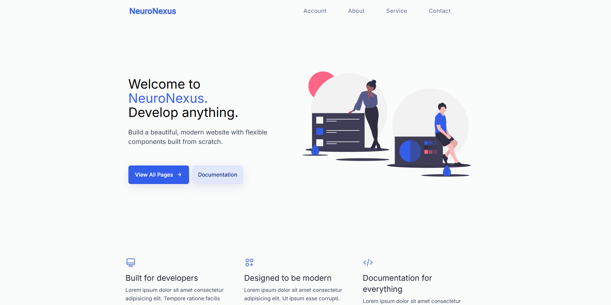

# NeuroNexus Landing Page



The **NeuroNexus Landing Page** is a single-file, responsive, and modern landing page that showcases a developer toolkit (Devkit). Entirely self-contained in a single `index.html` file, it features a clean design, animated scroll effects, interactive navigation, and a functional contact form.

---

## 🌟 Features

- ✅ **Single File**: All HTML, CSS, JavaScript, and SVG content embedded in one `index.html`.
- 📱 **Responsive Layout**: Adapts beautifully to mobile, tablet, and desktop screens.
- 📂 **Interactive Navigation**: Includes a hamburger menu with toggle behavior for smaller devices.
- 📧 **Contact Form**: Collects user details (name, contact number, address, company, email, department, gender).
- 🎯 **Scroll Animations**: Smooth fade-in effects using AOS (Animate On Scroll).
- 🌐 **Social Media Footer**: Icons linked to Facebook, Twitter, Instagram, LinkedIn, and GitHub.
- 🎨 **Modern Design**: Professional aesthetic with embedded SVGs and minimal layout.

---

## 🚀 Setup and Usage

### 🖥 Prerequisites

- A modern web browser (Chrome, Firefox, Edge, etc.)
- A code/text editor like [VS Code](https://code.visualstudio.com/) (for customization)

### 📁 Steps to Run

1. **Clone or Download the Repository**
   ```bash
   git clone https://github.com/Nyayabrata01/NeuroNexus.git
   cd NeuroNexus
